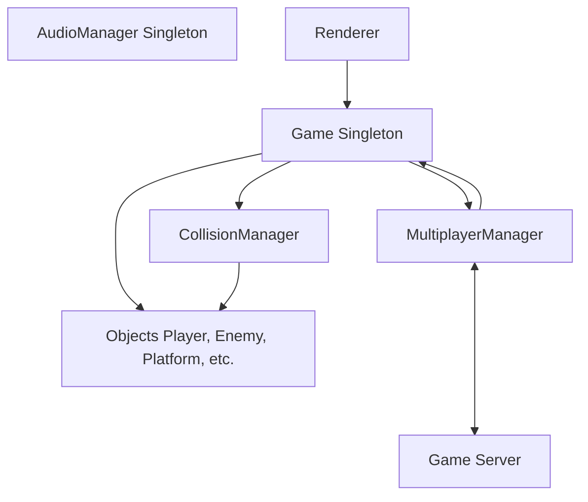
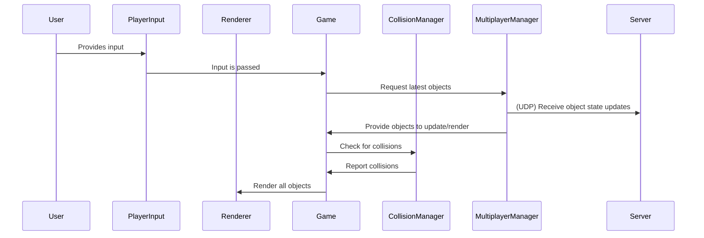
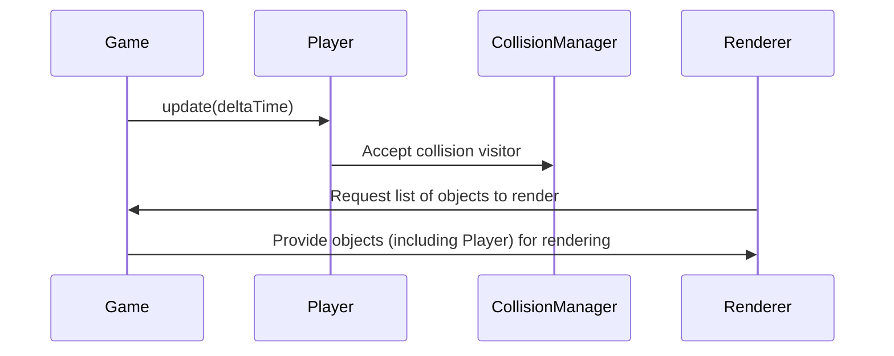

# Architecture Overview

This document provides an overview of the architecture for the SagaOfSacrifice2 codebase, focusing on the game logic inside the `SOS/` folder. The diagrams and descriptions below are based on actual class structures and relationships observed in the repository.  

---

## High-Level System Architecture

---

## In-Depth: Core Game Code (`SOS/` Folder)

### Main Components

#### 1. `Game` Class (`SOS/include/game.h`, `SOS/src/game.cpp`)
- **Role**: Central orchestrator of the game loop, state management, multiplayer, and object lifecycle.
- **Key Responsibilities**:
  - Holds all main objects: player, actors, objects, managers.
  - Updates all objects per frame.
  - Handles state transitions (MENU, RUNNING, SERVER_SELECTION).
  - Integrates multiplayer and local server management.
  - Manages chat, input, and rendering delegation.
- **Interactions**: 
  - Communicates with `LevelManager`, `CollisionManager`, `MultiplayerManager`, `Renderer`, and input/audio systems.
  - Owns vectors of `Object` and `Actor` pointers.

#### 2. Level Management (`LevelManager` & `Level`)
- **Role**: Handles loading, updating, resetting, and unloading levels.
- **Responsibilities**:
  - Manages level objects (platforms, enemies, etc.).
  - Controls player spawn points and background assets.
  - Detects and resolves collisions at the level scope.

#### 3. Object System
- **Base Class**: `Object` (`SOS/include/object.h`)
  - **Polymorphic**: Abstract base for all game entities.
  - **Methods**: `update()`, `accept(CollisionVisitor&)`, animation, and position management.
  - **Derived Classes**: `Player`, `Enemy`, `Platform`, `Minotaur`, `Item`, etc.
  - **Actors**: Non-interactive objects (e.g., text, background).

#### 4. Collision System

- **Pattern**: Uses Visitor pattern for collision resolution.
- **Key Classes**:
  - `CollisionVisitor` (interface for visiting object types)
  - `CollisionHandler` (implements collision logic for each object type)
  - `CollisionManager` (detects and resolves collisions among objects)

#### 5. Multiplayer System

- **Class**: `MultiplayerManager`
  - Handles networking, state sync, and chat between clients and server.
  - Supports both client (integrated in game) and server (standalone, see `server/`).
  - Uses Boost and C++17 features.

#### 6. Rendering

- **Class**: `Renderer` (see `SOS/include/petalinux/Renderer.h`)
  - Specialized for embedded systems (PetaLinux/FPGA integration).
  - Handles DMA transfers, hardware interrupts, and sprite management.
  - Renders all objects and actors each frame.

#### 7. Utilities & Support

- **Input Handling**: `PlayerInput` interface.
- **Audio**: `SDL2AudioManager`
- **Physics/Math**: `Vec2`, utility math classes.
- **Asset Management**: Loads spritesheets and assets at runtime.

---

## Example Game Loop Flow

---

## Example: Player Update Flow

---

## Additional Notes

- **Extensibility**: New object types can be added by deriving from `Object` and implementing required virtual methods.
- **Multiplayer**: Server-authoritative logic supports prediction and reconciliation.
- **Platform**: Designed for both desktop and embedded (PetaLinux/FPGA) targets.

---

## See Also

- [More files and details for SOS/ folder (GitHub search)](https://github.com/dinordi/SagaOfSacrifice2/search?q=path%3A%2FSOS%2F)
- [Multiplayer documentation (MULTIPLAYER.md)](https://github.com/dinordi/SagaOfSacrifice2/blob/main/MULTIPLAYER.md)

---
*This overview is based on a partial code search and may not include every class or relationship. For the full picture, please review the repository directly.*
