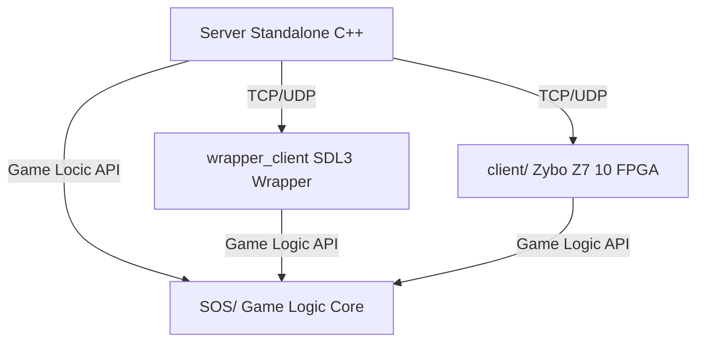

# System Overview

- **Server**: Standalone C++ application handling multiplayer for all clients.
- **wrapper_client**: SDL3-based client for desktop (Linux/Windows/macOS).
- **client/**: Zybo Z7 10 FPGA client, uses custom graphics accelerated by the FPGA.
- **SOS/**: Shared core game logic, used by both types of clients.

---
